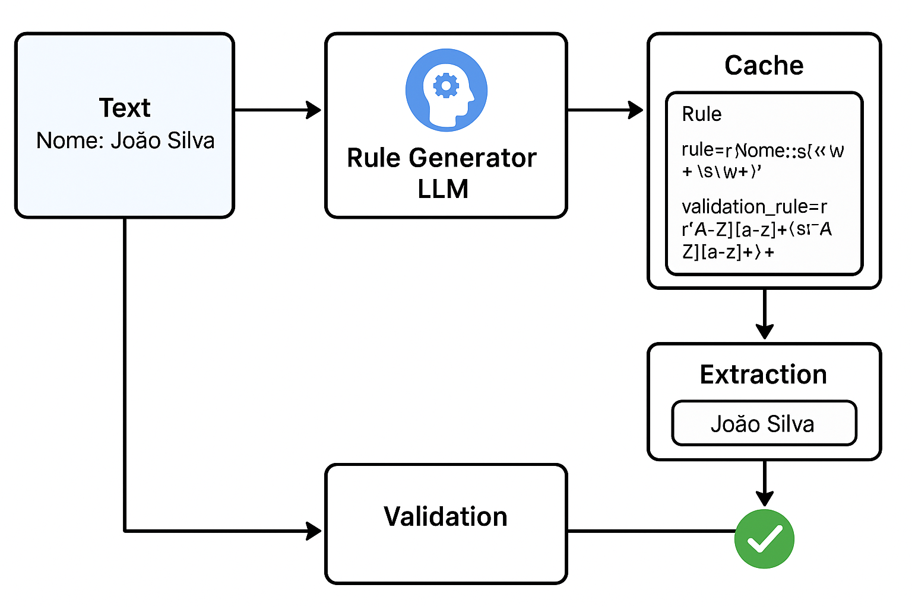

### Geração e Validação de Regras

A principal otimização do sistema ocorre por meio da **geração de Rules** ([`rule.py`](../src/rule.py)) pela **Rule Generator LLM**, que são armazenadas em uma **estrutura de cache** ([`cache.py`](../src/cache.py)) para permitir extração rápida (*fast path*).

Cada **Rule** define uma ou mais **expressões regulares (regex)** específicas para extrair um determinado campo de um texto.
Além da regex principal de extração, a **Rule Generator LLM** também gera uma **regex de validação**, usada para confirmar se o valor extraído está em um formato válido, aumentando a precisão e robustez do processo de extração.

---

### Exemplo 1 — Campo de Nome

**Texto de entrada:**

```
Nome: João Silva
```

**Esquema desejado (fornecido pela LLM Extractor):**

```json
{
    "nome": "João Silva"
}
```

**Rule gerada:**

```python
Rule(
    rule=r"Nome:\s*(\w+\s\w+)",  # Regex principal para extrair o nome
    validation_rule=r"^[A-Z][a-z]+(\s[A-Z][a-z]+)+$"  # Regex de validação para garantir formato correto
)
```

**Processo:**

* A regex principal extrai `João Silva` do texto.
* A regex de validação confirma que o valor segue o padrão esperado (nomes iniciando com maiúscula).

---

### Exemplo 2 — Número de Inscrição (OAB)

**Texto de entrada:**

```
Inscrição: 12345/SP
```

**Esquema desejado:**

```json
{
    "inscrição": "12345/SP"
}
```

**Rule gerada:**

```python
Rule(
    rule=r"Inscrição:\s*(\d{3,6}/[A-Z]{2})",
    validation_rule=r"^\d{3,6}/[A-Z]{2}$"
)
```

**Processo:**

* A regex principal extrai `12345/SP`.
* A regex de validação garante que o valor tenha entre 3 e 6 dígitos, seguido de uma barra e duas letras maiúsculas (padrão de inscrição da OAB).

---

### Exemplo 3 — CPF

**Texto de entrada:**

```
CPF: 123.456.789-10
```

**Esquema desejado:**

```json
{
    "cpf": "123.456.789-10"
}
```

**Rule gerada:**

```python
Rule(
    rule=r"CPF:\s*(\d{3}\.\d{3}\.\d{3}-\d{2})",
    validation_rule=r"^\d{3}\.\d{3}\.\d{3}-\d{2}$"
)
```

**Processo:**

* A regex principal captura `123.456.789-10`.
* A regex de validação garante o formato de CPF com pontos e hífen.

---

### Exemplo 4 — Data de Emissão

**Texto de entrada:**

```
Data de emissão: 12/08/2023
```

**Esquema desejado:**

```json
{
    "data_emissao": "12/08/2023"
}
```

**Rule gerada:**

```python
Rule(
    rule=r"Data de emissão:\s*(\d{2}/\d{2}/\d{4})",
    validation_rule=r"^(0[1-9]|[12][0-9]|3[01])/(0[1-9]|1[0-2])/\d{4}$"
)
```

**Processo:**

* A regex principal captura `12/08/2023`.
* A regex de validação confirma que a data tem formato válido DD/MM/AAAA.
  ✅ Extração validada.

---

### Exemplo 5 — E-mail

**Texto de entrada:**

```
E-mail: joao.silva@example.com
```

**Esquema desejado:**

```json
{
    "email": "joao.silva@example.com"
}
```

**Rule gerada:**

```python
Rule(
    rule=r"E-mail:\s*([\w\.-]+@[\w\.-]+\.\w+)",
    validation_rule=r"^[\w\.-]+@[\w\.-]+\.\w+$"
)
```

**Processo:**

* A regex principal extrai `joao.silva@example.com`.
* A regex de validação garante que o valor tenha formato de e-mail válido.

---

